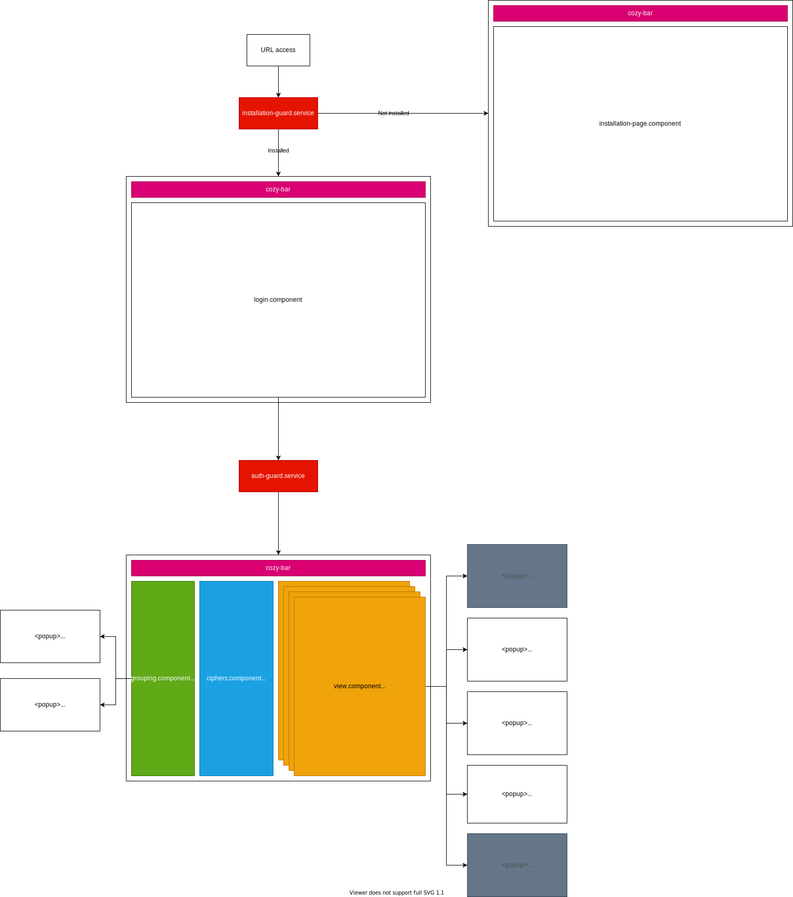
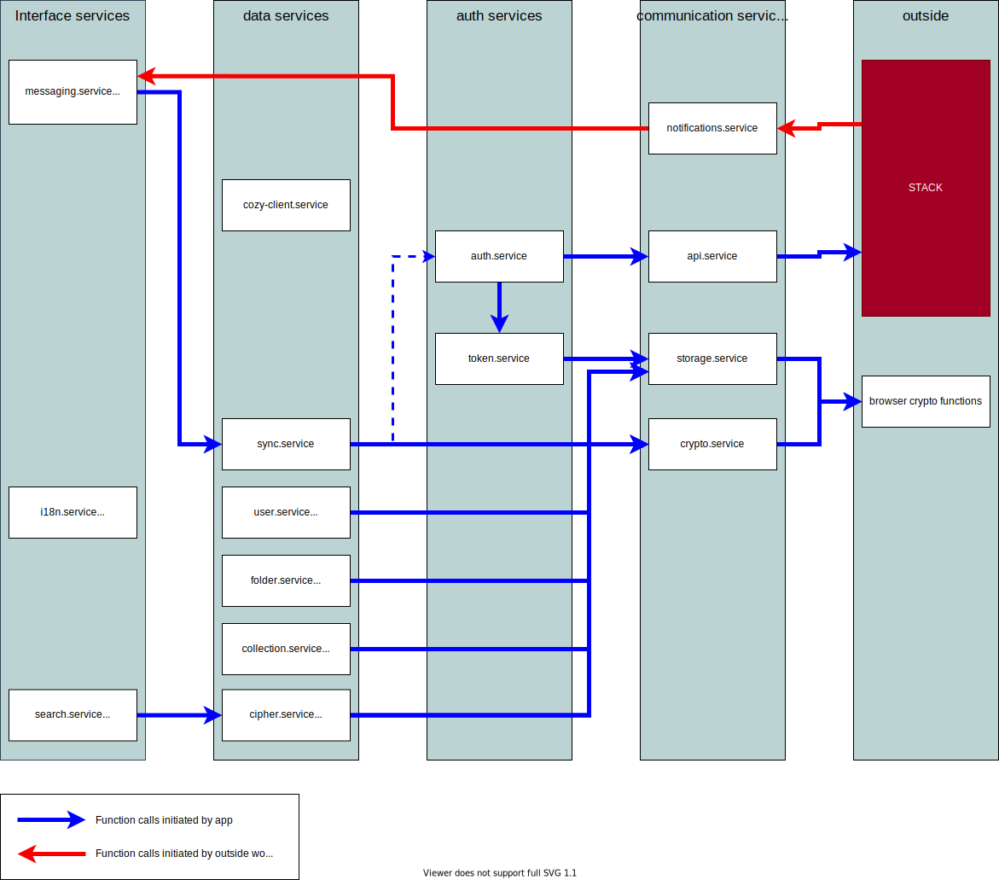

[Table of contents](README.md#table-of-contents)

# Project architecture

This document's goal is to reference architecture concepts used in the project

## Macro architecture

The following diagram show project's main components and how they interact together. Those component are placed as seen on the UI (login screen, main screen, popups etc) so you can easily find a component by knowing where it is visible on the application.

## Services architecture

The app's business code is split into multiple services. The following diagram list the project's main services and how they interact together

