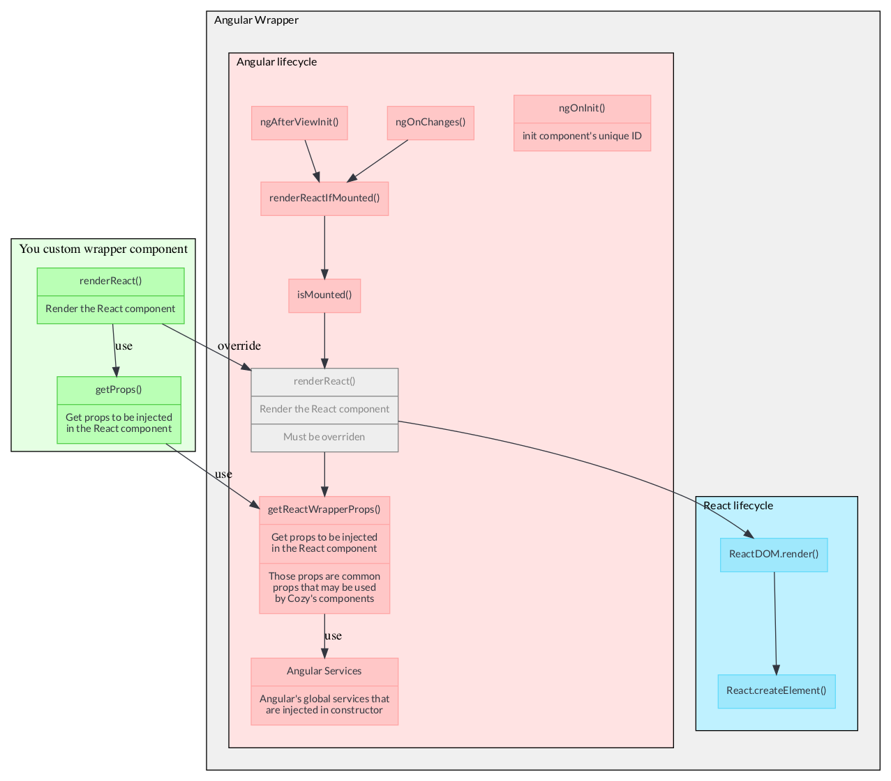

[Table of contents](README.md#table-of-contents)

# Using React components inside of Angular

`cozy-pass-web` is based on Bitwarden's technologies, therefore it is writen using Angular framework.

However, other Cozy's projects are written using React framework and you may need to import React components from those projects.

To achieve this goal, a set of wrappers is available in the project. Those wrappers are `AngularWrapperComponent` and `ReactWrapper` and are described in the following sections

## AngularWrapperComponent

`AngularWrapperComponent` is an Angular component that can load a given React component with enough context to manipulate the user's vault.

It implements the needed functions to map Angular component's lifecycle to the React component's one.



### Usage

`AngularWrapperComponent` cannot be used directly. You must create a new component that inherit `AngularWrapperComponent`.

```ts
import { Component, Input, ViewEncapsulation } from '@angular/core';

import { AngularWrapperComponent, AngularWrapperProps } from '../angular-wrapper.component';

import * as React from 'react';
import * as ReactDOM from 'react-dom';

// @ts-ignore
import ReactButton from './reactButton.jsx'; // this is the React component we want to wrap 

// those are the component's props types
interface ReactButtonProps extends AngularWrapperProps {
    label: string;
    onClick: (() => {});
}

@Component({
    selector: 'app-react-button',
    templateUrl: '../angular-wrapper.component.html',
    encapsulation: ViewEncapsulation.None,
})
export class SharingComponent extends AngularWrapperComponent {
    @Input() label: string = null;
    @Output() onClick = new EventEmitter<CipherView>();

    /******************/
    /* Props Bindings */
    /******************/

    // use this method to create all the props to be injected in the document
    protected async getProps(): Promise<ReactButtonProps> {
        // this loads the common props we may need to inject (bitwarden's services, cozy-client, vault properties)
        // skip this if you don't need them 
        const reactWrapperProps = await this.getReactWrapperProps();

        return {
            reactWrapperProps: reactWrapperProps,
            label: this.label,
            onClick: this.propOnClick.bind(this), // don't forget to bind methods on the component's context
        };
    }

    /**********/
    /* Render */
    /**********/

    // this overrides the AngularWrapperComponent's renderReact() method
    // this method will be called on component's lifecycle events
    protected async renderReact() {
        ReactDOM.render(
            React.createElement(ReactButton, await this.getProps()),
            this.getRootDomNode() // this is a reference to the DOM container declared in 'angular-wrapper.component.html'
        );
    }

    /********************/
    /* Callback Methods */
    /********************/

    protected async propOnClick(organizationId: string) {
      this.onClick.emit();
    }
}
```

## ReactWrapper

`ReactWrapper` is a React component that may be used to wrap any Cozy's component that need to be in a Cozy's context (`I18n`, `CozyProvider`, `BreakpointsProvider`, `MUICozyTheme`, etc.)


### Usage

First create a `.jsx` and create your wrapped component

```jsx
import React from "react";
import CozyComponent from "../../react/components/CozyComponent";
import ReactWrapper, { reactWrapperProps } from "../react-wrapper";

const CozyComponentWrapper = ({ reactWrapperProps }) => { // reactWrapperProps is injected from AngularWrapperComponent
  return (
    <ReactWrapper reactWrapperProps={reactWrapperProps}>
      <CozyComponent></CozyComponent>
    </ReactWrapper>
  );
};

CozyComponentWrapper.propTypes = {
  reactWrapperProps: reactWrapperProps.isRequired
}

export default CozyComponentWrapper;
```

Then create the corresponding Angular component in a `.ts` file and make it inherit `AngularWrapperComponent` (see previous section)


## Common rules and notes

Here is a set of rules that can be used to keep the code homogeneous and predictable and some notes that may help you debuging the code :

- Create your React components on `src/cozy/wrappers/<name-of-your-component>/`
  - `src/cozy/react/` is only used to include old `cozy-password` project sources and should not be used for new components
- use `// @ts-ignore` to remove errors about not-typed `.jsx` imports
  - if the component comes from a library that supports type document, then always prefer completing the documentation
- Changes on `.jsx` files are sometimes ignored by hot-reload. In this situation, please restart the `npm run start` command
